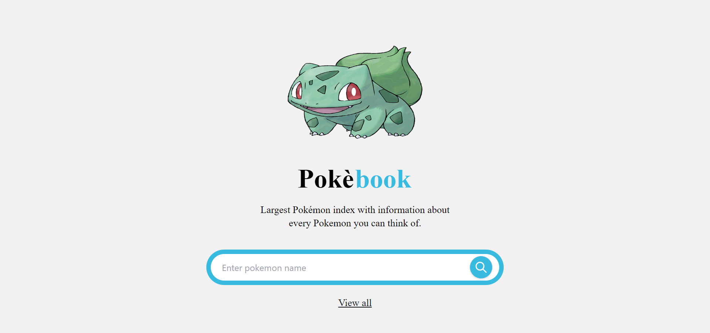

# Pokebook

Pokebook is a simple web application built using ReactJS that fetches data from the PokeAPI and displays information about various Pokemons. The application is designed to allow users to browse through Pokemons, see their images, and view various details like their types, stats, and abilities. [LIVE DEMO](https://pokebook-swart.vercel.app)

## Features

- Search for Pokemon by name
- View Pokemon details including stats, abilities, and type
- Responsive design for mobile and desktop

## Technologies Used

- React.js
- Tailwind CSS
- PokeAPI

## Installation

1. Clone the repository.
2. Navigate to the project directory in your terminal.
3. Run `npm install` to install the required dependencies.
4. Run `npm start` to start the development server.
5. Open your web browser and navigate to `http://localhost:3000/` to view the app.

## Usage

To search for a Pokemon, simply type its name in the search bar and press enter or click the search button. The app will display the Pokemon's details, including its stats, abilities, and type. You can click on the "Similar Pokemon" button to view other Pokemon with the same type.

## Credits

- [PokeAPI](https://pokeapi.co/): The API used to retrieve Pokemon data.
- [Tailwind CSS](https://tailwindcss.com/): The utility-first CSS framework used to style the app.

## Wana know more? Check me out

[Linkedin](https://linkedin.com/in/ekow-prince)
[Twitter](https://twitter.com/itssthetechguy)

## License

This project is licensed under the MIT License. See the `LICENSE` file for details.
